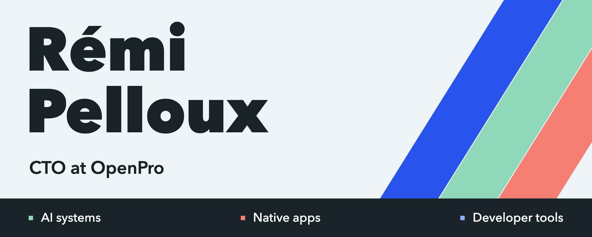
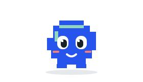
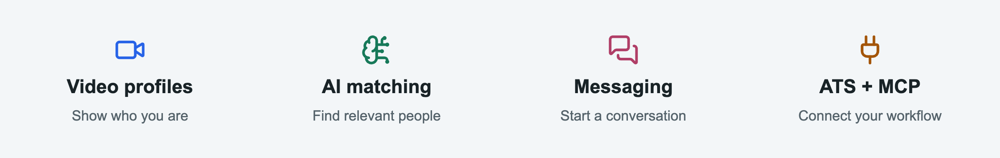
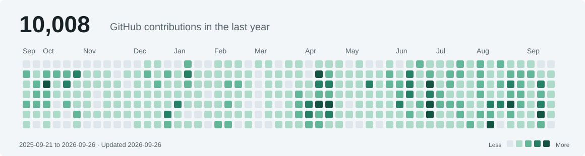
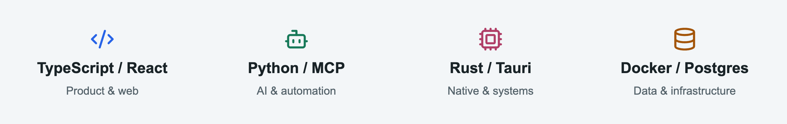

  <picture>
    <source media="(max-width: 600px)" srcset="./assets/profile-banner-mobile.png" />
    
  </picture>

  <a href="https://github.com/RemiPelloux/OpenAgents">
    <picture>
      <source media="(prefers-reduced-motion: reduce)" srcset="./assets/openpro-mascot-still.png" />
      
    </picture>
  </a>

<h1 align="center">Rémi Pelloux · CTO at OpenPro</h1>

<strong>AI agents. Native apps. Connected products.</strong> 
Software engineer & technology leader based in France.

  <a href="https://openpro.ai">OpenPro</a> &nbsp; · &nbsp;
  <a href="#projects">Projects</a> &nbsp; · &nbsp;
  <a href="#github-contributions">Contributions</a> &nbsp; · &nbsp;
  <a href="https://www.linkedin.com/in/remipelloux/">LinkedIn</a>

## What we do at OpenPro

We connect **people, jobs and companies** through a French professional network:
video CVs and job offers, AI matching, real-time messaging and Mia, our AI assistant.
Available on web, iOS and Android; free for candidates. **I lead the technology.**

<a href="https://openpro.ai">
  <picture>
    <source media="(max-width: 600px)" srcset="./assets/openpro-features-mobile.png" />
    
  </picture>
</a>

[Explore OpenPro](https://openpro.ai) · [Connect your ATS](https://github.com/RemiPelloux/openpro-connector-sdk)

## GitHub contributions

<a href="https://github.com/RemiPelloux?tab=overview">
  <picture>
    <source media="(max-width: 600px)" srcset="./assets/contributions-mobile.svg" />
    
  </picture>
</a>

GitHub contribution data · Refreshed daily · Activity across original projects and maintained forks

## Projects

<table>
<tr>
<td width="50%" valign="top">
<picture>
<source media="(prefers-reduced-motion: reduce)" srcset="./assets/icons/openplod.svg" />

</picture>
<h3><a href="https://github.com/RemiPelloux/OpenPlod">OpenPlod</a></h3>
<strong>Turn recordings into knowledge.</strong>

A local audio vault with Plaud imports, AI transcripts, Markdown documents and MCP.

<code>TypeScript</code> <code>Rust</code> <code>Tauri</code>

<a href="https://github.com/RemiPelloux/OpenPlod/releases/tag/v0.3.0">Explore v0.3.0</a> 
Experimental; Plaud authorization required.
</td>
<td width="50%" valign="top">
<picture>
<source media="(prefers-reduced-motion: reduce)" srcset="./assets/icons/lumasync.svg" />

</picture>
<h3><a href="https://github.com/RemiPelloux/lumasync">LumaSync</a></h3>
<strong>Bring your screen into the room.</strong>

Local Philips Hue lighting driven by fast screen capture and perceptual color analysis.

<code>Rust</code> <code>DXGI</code> <code>React</code>

<a href="https://github.com/RemiPelloux/lumasync/commit/11d8bdd12079a1e7d4559e9762d1ff70b00013ca">See the color engine</a> 
Windows + Hue Bridge. Frames stay local.
</td>
</tr>
<tr>
<td width="50%" valign="top">

<h3><a href="https://github.com/RemiPelloux/OpenAgents">OpenAgents</a></h3>
<strong>Give agents the tools to act.</strong>

Self-hosted AI agents with memory, MCP, multiple model providers and team workflows.

<code>Python</code> <code>MCP</code> <code>Docker</code>

<a href="https://github.com/RemiPelloux/OpenAgents/commit/3c53b593386388a1fdf49c0ff4c882b1ea4e5d43">My worker contributions</a> 
OpenPro fork of <a href="https://github.com/NousResearch/Hermes-agent">Hermes Agent</a>.
</td>
<td width="50%" valign="top">

<h3><a href="https://github.com/RemiPelloux/OpenNative">OpenNative</a></h3>
<strong>Bring PC gaming to handhelds.</strong>

Windows compatibility on Android, with per-game runtimes, controls and warm-prefix launches.

<code>Kotlin</code> <code>Android</code> <code>Wine</code>

<a href="https://github.com/RemiPelloux/OpenNative/commit/6ff47dfd13f0db65be005430ec5dc78ca5b5997b">My launch improvements</a> 
Built on <a href="https://github.com/utkarshdalal/GameNative">GameNative</a>.
</td>
</tr>
</table>

### Developer tools

 **[OpenPro Connector SDK](https://github.com/RemiPelloux/openpro-connector-sdk)** · Sync ATS jobs into OpenPro through PHP, HTTP and MCP.

 **[OpenWhistle SDKs](https://github.com/RemiPelloux/openwhistle-sdks)** · Connect audio workflows with clients for JavaScript, Python, PHP, Rust and Go.

 **[Containust](https://github.com/RemiPelloux/Containust)** · Daemon-less containers in Rust. Local and air-gapped workflows; commercial source-available license.

## Engineering stack

<picture>
  <source media="(max-width: 600px)" srcset="./assets/toolbox-mobile.png" />
  
</picture>

<code>PHP / Symfony</code> <code>Kotlin / C++</code> <code>AWS</code> <code>Redis</code> <code>RAG</code> <code>CI/CD</code>

<strong>What matters in my engineering</strong>

- Useful workflows, from first install to everyday use.
- Local data ownership, portable formats and practical APIs.
- Measured latency, reliable recovery and clear upstream credits.

---

<strong>Building useful software across AI, products and systems.</strong> 
<a href="https://www.linkedin.com/in/remipelloux/">Let's connect</a> ·
<a href="https://github.com/RemiPelloux?tab=repositories">Explore all repositories</a>

